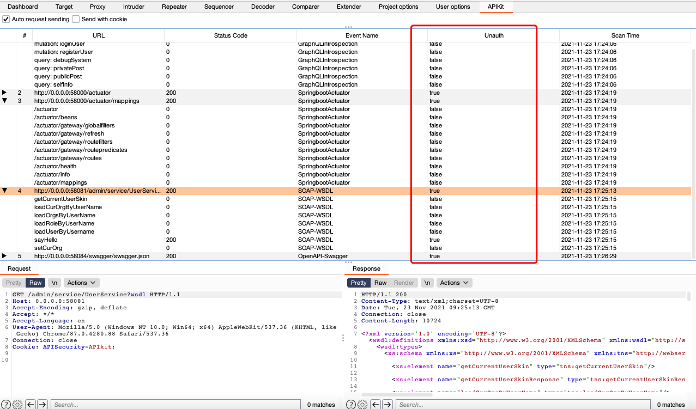

APIKit：Discovery, Scan and Audit APIs Toolkit All In One.
===

# 介绍
**APIKit**是[APISecurity社区](https://github.com/API-Security)发布的第一个开源项目。

**APIKit**是基于`BurpSuite`提供的`JavaAPI`开发的插件。 

**APIKit**可以主动/被动扫描发现应用泄露的`API文档`，并将`API文档`解析成`BurpSuite`中的数据包用于**API安全测试**。


实际使用效果如图：


# API技术指纹支持
APIKit v1.0支持的API技术的指纹有：
- [x] GraphQL
- [x] OpenAPI-Swagger 
- [x] SpringbootActuator
- [x] SOAP-WSDL

更多的API指纹正在努力更新~
- [ ] REST-WADL
- [ ] gRPC
- [ ] UPnP
- [ ] 更多主流API技术...


# 安装
打开`BurpSuite`页面,点击Extender然后选择Extensions,添加APIKit.jar。

然后APIKit会对进入到`BurpSuite`的流量进行被动扫描。解析完成后可以在APIKit面板查看结果，同样Burpsuite的DashBoard也会有issue提示。


# 配置
默认情况下Request和Cookie都不开启。

## Send with Cookie
开启Cookie，可以把包的Cookie存下来，生成请求的时候保留Cookie。

## Auto Request Sending
开启对API的请求，注意开启API请求后。你需要明确以下几点：

**1. 本工具仅面向合法授权的企业安全建设行为，如您需要测试本工具的可用性，请自行搭建靶机环境。**

**2. 在使用本工具进行检测时，您应确保该行为符合当地的法律法规，并且已经取得了足够的授权。请勿对非授权目标进行请求。**

**3. 如您在使用本工具的过程中存在任何非法行为或造成其他损失，您需自行承担相应后果，我们将不承担任何法律及连带责任。**

**4. 在安装并使用本工具前，请您务必审慎阅读、充分理解各条款内容，限制、免责条款或者其他涉及您重大权益的条款可能会以加粗、加下划线等形式提示您重点注意。 除非您已充分阅读、完全理解并接受本协议所有条款，否则，请您不要安装并使用本工具。您的使用行为或者您以其他任何明示或者默示方式表示接受本协议的，即视为您已阅读并同意本协议的约束。**

选择开启Auto Request Sending后，可以对子API进行自动化鉴权测试，快速发现API未授权访问漏洞。


# 被动扫描
默认情况下流经BurpSuite的流量都会进行API探测解析和扫描。
# 主动扫描
在任何一个Burpsuite可以右键打开更多选项的页面中，都可以**点击右键**，选择**Do API scan**来发起一次主动扫描。


# API漏洞自动扫描
所有与`BurpSuite`联动的工具均可联动APIKit。比如xray。
## xray配置
```shell
./xray_darwin_amd64 webscan --listen 127.0.0.1:7777  --html-output APIKit.html
```

## BurpSuite配置


# 实战案例
1. 某授权项目站点为/xxgateway/index，APIKit帮助发现/xxgateway/actuator并最后完成RCE。
2. 某SRC站点使用了swagger，使用APIKit和xray联动遍历所有的API，最终发现多个高危严重漏洞。
3. 更多白/黑盒测试...

# TODO
## 更多的API指纹
- Jolokia
- REST-WADL
- gRPC
- UPnP
- 更多主流API技术...
## 更多实用功能
- Fuzz鉴权绕过漏洞
- 检测请求返回包中敏感信息
— 发现js中泄露的API 
— 常见数据解析依赖库识别，比如Fastjson等
- 更多实用功能...

# 项目地址

https://github.com/API-Security/APIKit

**API Security是一个分享一切和API安全相关的工具、漏洞环境、书籍、技术文章、新闻资讯、最佳实践白皮书等资料的社区。**

**API Security知识星球永久免费，欢迎对API安全感兴趣的信息安全爱好者一起学习交流。**


